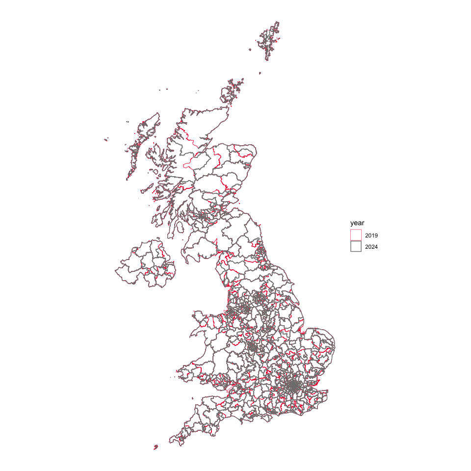
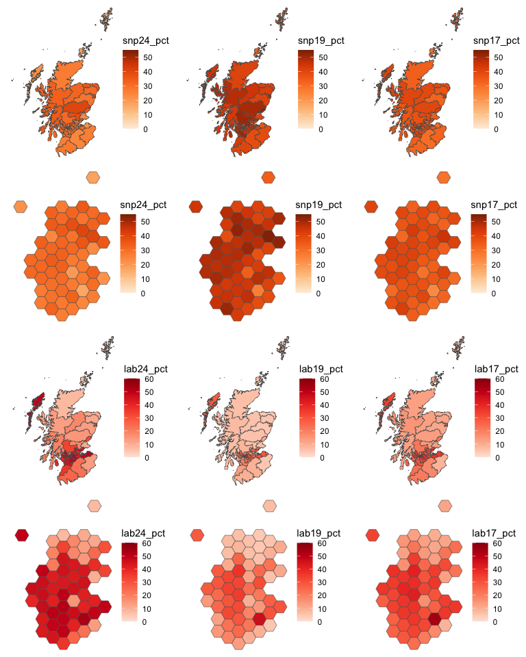
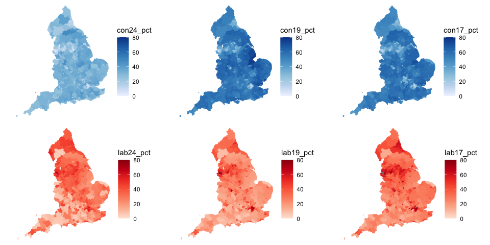
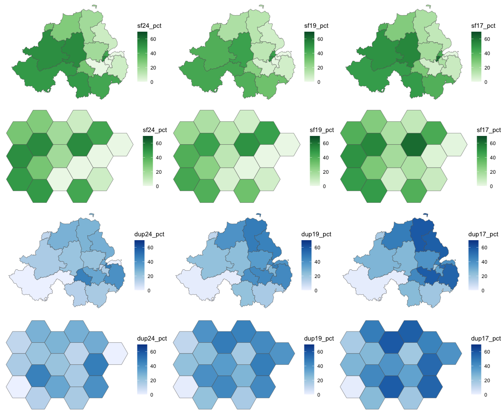

<!-- README.md is generated from README.Rmd. Please edit that file -->

# voteReproject

<!-- badges: start -->
<!-- badges: end -->

The 2017, 2019 and 2024 UK General Elections produced highly contrasting
results.

It is, however, difficult to compare certain aspects of them because of
boundary changes to constituencies which took effect for the 2024
election.

The goal of `voteReproject` is, by reprojecting voting data from the
earlier elections to the 2024 boundaries, to provide datasets which are
suitable for comparative analysis.

## Installation

You can install the development version of voteReproject from
[GitHub](https://github.com/) with:

``` r
# install.packages("devtools")
devtools::install_github("horankev/voteReproject")
```

## Boundary changes

The 2024 and 2017/19 constituency boundaries for UK General Elections
are mapped below.



## Reprojection

Votes are allocated to new (2024) constituencies from the boundaries
which existed in 2017/19 according to the proportion of the population
living in areas of overlap. The first five entries of the table used for
this projection are shown below.

| Current constituency code | Current constituency name | New constituency code | New constituency name | prop_old_in_new | Overlap UID |
|:---|:---|:---|:---|---:|:---|
| W07000049 | Aberavon | W07000081 | Aberafan Maesteg | 0.8167676 | Aberavon to Aberafan Maesteg |
| W07000049 | Aberavon | W07000103 | Neath and Swansea East | 0.1832324 | Aberavon to Neath and Swansea East |
| W07000058 | Aberconwy | W07000083 | Bangor Aberconwy | 1.0000000 | Aberconwy to Bangor Aberconwy |
| S14000001 | Aberdeen North | S14000060 | Aberdeen North | 0.7696923 | Aberdeen North to Aberdeen North |
| S14000001 | Aberdeen North | S14000061 | Aberdeen South | 0.2303077 | Aberdeen North to Aberdeen South |

source:
<https://commonslibrary.parliament.uk/boundary-review-2023-which-seats-will-change/>

## Examples

### Party position

Below are shown the winning party in each constituency from the 2024
election and the first-placed party from the two previous elections
subject to reprojection. The boundaries are sourced from
<https://geoportal.statistics.gov.uk> and the voting data from
<https://commonslibrary.parliament.uk/tag/elections-data/>.

``` r

ggarrange(
  ggplot(votestogether) +
    geom_sf(aes(fill=first_party24)) +
    scale_fill_manual(values = party_palette) + 
    theme_void(),
  
  ggplot(votestogether) +
    geom_sf(aes(fill=first_party19)) +
    scale_fill_manual(values = party_palette) + 
    theme_void(),
  
  ggplot(votestogether) +
    geom_sf(aes(fill=first_party17)) +
    scale_fill_manual(values = party_palette) + 
    theme_void(),
  
  ncol = 3
)
```


The problem of invisibility of constituencies which are small by area,
usually dense urban settings, can be overcome by using hexagonal
representations of the constituencies. Their positioning aims to closely
resemble their actual relative position. Here, we use hexagons created
by Philip Brown and Alasdair Rae from Automatic Knowledge
(<https://observablehq.com/@jwolondon/uk-election-2024-boundary-data>).

``` r

ggarrange(
  ggplot(votestogether_hex) +
    geom_sf(aes(fill=first_party24)) +
    scale_fill_manual(values = party_palette) + 
    theme_void(),
  
  ggplot(votestogether_hex) +
    geom_sf(aes(fill=first_party19)) +
    scale_fill_manual(values = party_palette) + 
    theme_void(),
  
  ggplot(votestogether_hex) +
    geom_sf(aes(fill=first_party17)) +
    scale_fill_manual(values = party_palette) + 
    theme_void(),
  
  ncol = 3
)
```


### Scotland

Looking at changes in votes in Scotland for the Scottish National Party
and Labour, in standard geographical form and as hexagons:



### England

Looking at changes in votes in England for the Conservatives and Labour,
in standard geographical form and as hexagons:



### Northern Ireland

Looking at changes in votes in Northern Ireland for Sinn Fein and the
Democratic Unionist Party, in standard geographical form and as
hexagons:


