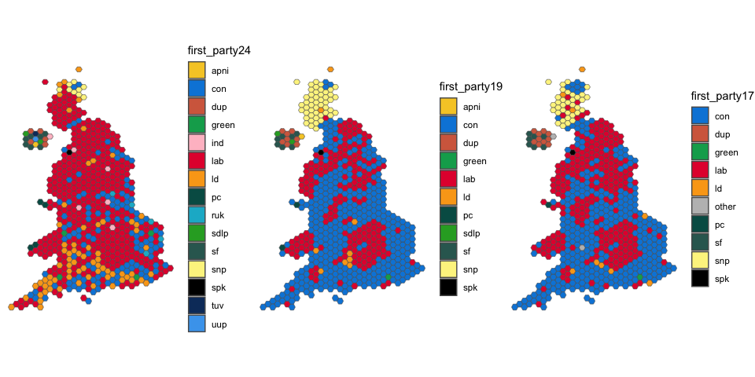

<!-- README.md is generated from README.Rmd. Please edit that file -->

# voteReproject

``` r
library(voteReproject)
library(tidyverse)
library(sf)
library(ggpubr)
```

<!-- badges: start -->
<!-- badges: end -->

The 2017, 2019 and 2024 UK General Elections produced highly contrasting
results.

It is, however, difficult to compare certain aspects of them because of
boundary changes to constituencies which took effect for the 2024
election.

The goal of `voteReproject` is, by reprojecting voting data from the
earlier elections to the 2024 boundaries, to provide datasets which are
suitable for comparitive analysis.

## Installation

You can install the development version of voteReproject from
[GitHub](https://github.com/) with:

``` r
# install.packages("devtools")
devtools::install_github("horankev/voteReproject")
```

## Example

Below are shown the winning party in each constituency from the 2024
election and the first-placed party from the two previous elections
subject to reprojection.

``` r

ggarrange(
  ggplot(votestogether) +
    geom_sf(aes(fill=first_party24)) +
    scale_fill_manual(values = party_palette) + 
    theme_minimal(),
  
  ggplot(votestogether) +
    geom_sf(aes(fill=first_party19)) +
    scale_fill_manual(values = party_palette) + 
    theme_minimal(),
  
  ggplot(votestogether) +
    geom_sf(aes(fill=first_party17)) +
    scale_fill_manual(values = party_palette) + 
    theme_minimal(),
  
  ncol = 3
)
```


The problem of invisibility of constituencies which are small by area,
usually dense urban settings, can be overcoome by using hexagonal
representations of the constituencies. Their positioning aims to closely
resemble their actual relative position.

``` r

ggarrange(
  ggplot(votestogether_hex) +
    geom_sf(aes(fill=first_party24)) +
    scale_fill_manual(values = party_palette) + 
    theme_minimal(),
  
  ggplot(votestogether_hex) +
    geom_sf(aes(fill=first_party19)) +
    scale_fill_manual(values = party_palette) + 
    theme_minimal(),
  
  ggplot(votestogether_hex) +
    geom_sf(aes(fill=first_party17)) +
    scale_fill_manual(values = party_palette) + 
    theme_minimal(),
  
  ncol = 3
)
```


